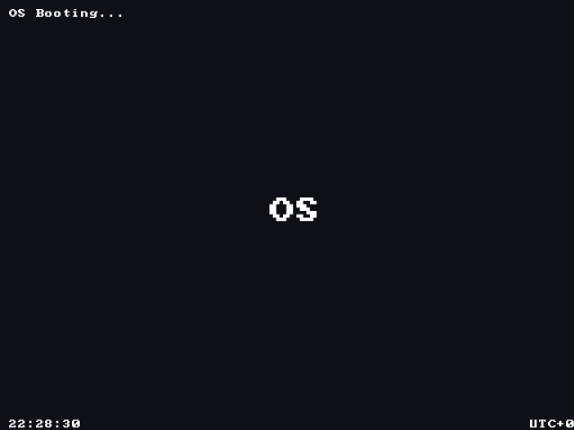
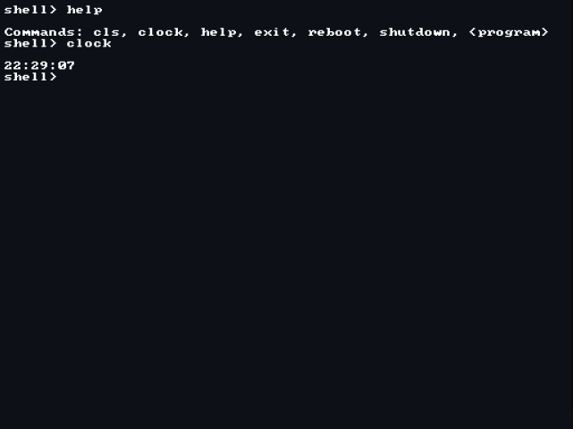
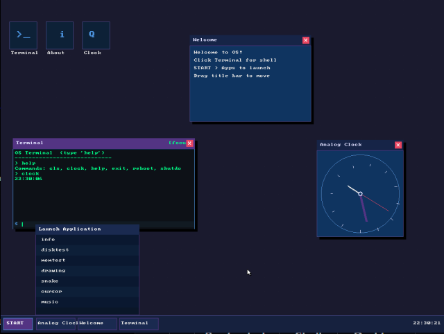
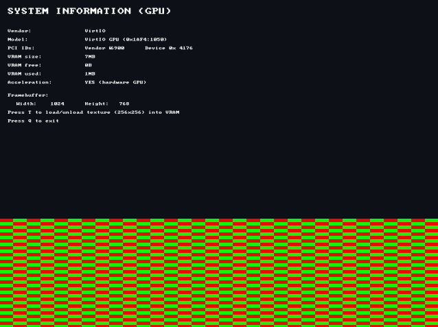
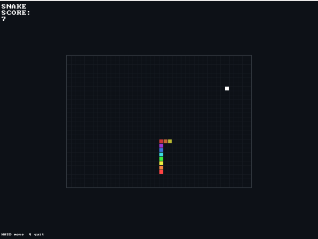
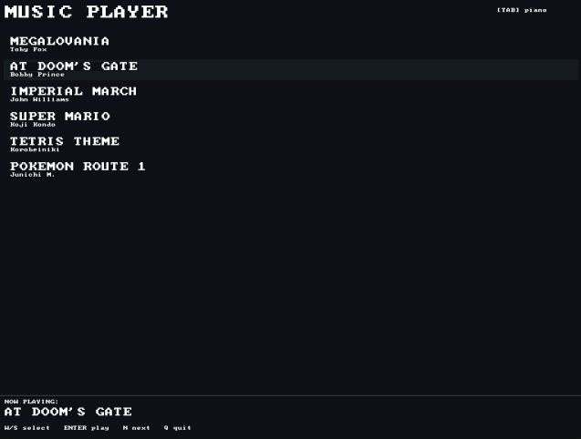

# My OS from Scratch (OS)

Built during Lock-In week 1 of FlavorTown. No proper name yet so the URL might change at some point.

## What it does

- Boots via the **Limine bootloader** and splashes a big **OS** in the middle of your screen
- Shows the current time and timezone (UTC by default, change the `timer_set_timezone()` call in `kernel.c` if you want)
- Has a working **shell** with basic commands
- Has a full **windowed desktop** with draggable windows, a taskbar, a Start menu, and an analog clock widget
- Dynamically loads and runs **userspace programs** — the kernel literally scans an ELF section for registered programs and just runs them, which honestly took way too long to figure out but is extremely cool
- Comes with a few programs out of the box:
  - `desktop` — a full GUI with mouse support, draggable windows, a terminal, and an app launcher that auto-discovers every registered program
  - `drawing` — move a cursor around and draw pixels on screen
  - `snake` — fully playable snake with a rainbow-colored snake because why not
  - `music` — plays songs through the PC speaker with a lot of songs included + a playable piano/keyboard (Songs thanks to the people who helped write songs for the API)
  - `info` — system info screen (memory, screen size, GPU info, etc.)
  - `memtest` — heap stress test
  - `storage` — ATA disk driver with a basic filesystem on top
- Detects your GPU via a PCI bus scan (Intel, AMD, NVIDIA, VMware, VirtIO) and knows the vendor, device ID, and VRAM size — but doesn't actually *use* it in most situations currently. All rendering goes straight through the Limine framebuffer except some, which indeed go through the GPU.

---

## Screenshots

| Boot splash | Shell | Desktop |
|---|---|---|
|  |  |  |

| GPU acceleration | Snake | Music Player |
|---|---|---|
|  |  |  |

---

## Shell commands (non-programs)

```
cls          clear the screen
clock        show current time
help         list commands
reboot       reboot the machine
shutdown     shut it down
exit         halt the CPU (rip)
<program>    run any userspace program by name
```

---

## Architecture (roughly)

```
┌──────────────────────────────────────────────┐
│              Userspace Programs              │
│  shell  desktop  snake  music  drawing  ...  │
├──────────────────────────────────────────────┤
│                  init system                 │
│   (discovers programs, runs test, launches)  │
├──────────────────────────────────────────────┤
│                  Libraries                   │
│  draw · font · keyboard · mouse · timer      │
│  memory · speaker · power · libc subset      │
├──────────────────────────────────────────────┤
│                   Kernel                     │
│   framebuffer init · heap setup · RTC        │
├──────────────────────────────────────────────┤
│             Limine Bootloader                │
└──────────────────────────────────────────────┘
        VM x86-64 hardware
```

The userspace loader works by putting every program struct into a custom `.userspace_programs` ELF section. At runtime `init` scans from `__start_userspace_programs` to `__stop_userspace_programs`, matches the name, runs the test function, and launches it. Biggest breakthrough of the whole project tbh.

---

## How to build and run

Clone the repo and `cd` into it. You need `x86_64-linux-gnu-gcc`, `xorriso`, and `qemu-system-x86_64`.

```bash
make clean && make && make run
```

This compiles everything, creates `OS.iso`, and launches it in QEMU with VirtIO GPU and PC speaker audio. That's it.

Full platform-specific instructions are further down if you're on Windows or macOS.

---

## How it works — component breakdown

### Kernel

`kmain()` is the entry point. It immediately switches to a dedicated stack to avoid triple-faults from deep call chains, then:

1. Calls `draw_init()` to configure the Limine framebuffer.
2. Fills the screen and shows an "OS Booting…" splash.
3. Calls `timer_init()` to start the RTC, sets the UTC offset.
4. Draws the centred "OS" logo and the current time.
5. Waits 2 seconds so you can actually read the splash.
6. Calls `memory_init()` to bring up the heap (16 MB at `0x1000000`).
7. Calls `init_main("shell")` to hand off to userspace. The kernel never returns.

`kernel/linker.ld` defines the `.userspace_programs` section that makes the whole program discovery system work.

### Libraries

**`draw`** — Full GPU-abstracted graphics layer. Detects the GPU via PCI, selects a driver, and exposes `put_pixel`, `fill_rect`, `draw_line`, `draw_circle`, `draw_string`, and more. Also has basic VRAM allocation stubs ready for when the hardware-accelerated path gets wired up.

**`font`** — Bitmapped font renderer. Supports arbitrary integer scale factors, which is why everything in the OS can be drawn at 1x, 2x, or bigger.

**`keyboard`** — PS/2 keyboard driver. Polls port `0x60`, translates scan codes to ASCII. Exposes `keyboard_init()`, `keyboard_read()` (blocking), and `keyboard_has_key()` (non-blocking).

**`mouse`** — PS/2 mouse driver. Reads 3-byte packets (buttons + delta-X/Y), clamps to screen bounds. Exposes `mouse_init()`, `mouse_poll()`, and `mouse_get_state()`.

**`timer`** — RTC/CMOS driver. Reads the hardware clock, applies a UTC offset, provides `timer_get_time()` and `timer_delay_s()`.

**`memory`** — Simple free-list heap allocator. Initialised by the kernel. `kmalloc()` and `kfree()`.

**`speaker`** — PC speaker driver with a note/frequency API. Used by the music player.

**`power`** — `power_reboot()` via keyboard controller reset. `power_shutdown()` via ACPI S5 port write.

**`libc/`** — Freestanding libc subset: `printf`, `snprintf`, `puts`, `strlen`, `strcmp`, `memcpy`, `memset`, `atoi`, ctype helpers. No host libc anywhere.

### Userspace & init

Every program is one struct placed in the `.userspace_programs` linker section:

```c
struct userspace_program {
    const char     *name;   // command name
    userspace_entry main;   // void fn(void)
    userspace_test  test;   // int fn(void) — 1 = OK, 0 = broken
};
```

`init_main(name)` finds the matching program, calls its `.test()`, shows `[OK]` or `[FAILED]` on screen, flushes the PS/2 buffer so leftover mouse/keyboard bytes don't leak into the new program, clears the screen, and calls `.main()`. On return it flushes PS/2 again so the caller gets a clean input state.

### Programs

**`shell`** — Text-mode CLI. Draws `shell>`, reads keystrokes, handles backspace and enter, dispatches to built-in commands or `init_main()` for anything else.

**`desktop`** — Windowed GUI. Dot-grid background, draggable windows with title bars and close buttons, taskbar with a live clock, Start menu, app launcher that auto-discovers all registered programs, windowed terminal, and an analog clock window with hands rendered via a sin/cos lookup table (no FPU needed).

**`snake`** — Classic Snake on a 42×30 grid. Rainbow body because why not. Timer-paced, keyboard-controlled.

**`music`** — PC speaker player. Songs are `Note[]` arrays (frequency + duration). Ships with Megalovania and others. Press a key to skip tracks.

**`drawing`** — Freehand pixel canvas.

**`info`** — System info: screen resolution, GPU vendor/device ID, VRAM size, free heap.

**`memtest`** — Allocates and frees heap blocks, verifies contents, reports pass/fail.

**`storage`** — ATA PIO driver, a simple flat filesystem (SFS), a RAM filesystem (RAMFS), and a VFS layer on top. Reads/writes the QEMU IDE disk image.

---

## Building

> You dont have to build the OS.iso yourself. 
> You can also download it from the github releases page and skip the building section.

**Ubuntu / Debian:**
```bash
sudo apt update
sudo apt install gcc-x86-64-linux-gnu binutils-x86-64-linux-gnu xorriso qemu-system-x86
```

**Arch Linux:**
```bash
sudo pacman -S x86_64-linux-gnu-gcc x86_64-linux-gnu-binutils xorriso qemu
```

**macOS (Homebrew):**
```bash
brew install x86_64-elf-gcc x86_64-elf-binutils xorriso qemu
# Then edit the Makefile: change the CC and LD prefixes to x86_64-elf-
```

Then:
```bash
git clone --recurse-submodules https://github.com/QKing-Official/os.git
cd os
make          # produces OS.iso
make disk.img # first time only — 64 MB blank IDE disk for storage
```

---

## Running on QEMU

### Linux (build it on debian 13 WSL)

```bash
make disk.img   # first time only
make run
```

Or manually (replace `pa` with `pipewire` or `alsa` if needed):
```bash
qemu-system-x86_64 \
  -cdrom OS.iso -boot d \
  -m 256M \
  -audiodev pa,id=snd0 -machine pcspk-audiodev=snd0 \
  -vga virtio -global virtio-gpu-pci.vgamem_mb=256 \
  -drive file=disk.img,format=raw,if=ide,index=0,media=disk
```

### Windows (tested on win11)

1. Install [QEMU for Windows](https://www.qemu.org/download/#windows).
2. Open PowerShell in the project folder.
3. Create the disk image (first time only): `qemu-img create -f raw disk.img 64M`
4. Run:
```powershell
qemu-system-x86_64 `
  -cdrom OS.iso -boot d `
  -m 256M `
  -audiodev dsound,id=snd0 -machine pcspk-audiodev=snd0 `
  -vga virtio -global virtio-gpu-pci.vgamem_mb=256 `
  -drive file=disk.img,format=raw,if=ide,index=0,media=disk
```
Drop the `-audiodev` / `-machine pcspk-audiodev` lines if you don't need music.

### macOS (untested since I dont own a mac. This should work)

Homebrew QEMU doesn't have PulseAudio, use `coreaudio` instead:
```bash
qemu-system-x86_64 \
  -cdrom OS.iso -boot d \
  -m 256M \
  -audiodev coreaudio,id=snd0 -machine pcspk-audiodev=snd0 \
  -vga virtio -global virtio-gpu-pci.vgamem_mb=256 \
  -drive file=disk.img,format=raw,if=ide,index=0,media=disk
```

On **Apple Silicon (M1/M2/M3)** x86-64 is fully emulated so it's a bit slower. Add `-accel tcg,thread=multi` for a speed bump:
```bash
qemu-system-x86_64 -accel tcg,thread=multi \
  -cdrom OS.iso -boot d -m 256M \
  -audiodev coreaudio,id=snd0 -machine pcspk-audiodev=snd0 \
  -vga virtio -global virtio-gpu-pci.vgamem_mb=256 \
  -drive file=disk.img,format=raw,if=ide,index=0,media=disk
```

---

## Writing a new program

The linker auto-discovers programs — there's no registration table to touch.

**1.** Create `userspace/myprog/myprog.c`:

```c
#include "../../libraries/draw.h"
#include "../../libraries/keyboard.h"
#include "../../libraries/timer.h"
#include "../userspace.h"

static void myprog_main(void) {
    fill_rect(0, 0, screen_width(), screen_height(), 0xFF0D1117);
    set_fg(0xFF00FF88);
    set_bg(0xFF0D1117);
    draw_string(20, 20, "Hello from myprog!", 2);

    keyboard_init();
    timer_delay_ms(5000); // Wait for 5 seconds
    keyboard_read(); // wait for a key before returning
}

static int myprog_test(void) { return 1; }

// This one line is all the wiring you need
__attribute__((used, section(".userspace_programs"), aligned(1)))
struct userspace_program myprog_prog = {
    .name = "myprog",
    .main = myprog_main,
    .test = myprog_test,
};
```

**2.** Build — the Makefile already globs all `.c` files, nothing else to change:

```bash
make && make run
```

**3.** Run it from the shell (`shell> myprog`) or it'll appear automatically in `START → Apps` on the desktop.

### API cheat sheet (excluding my simple libc)

```c
// Graphics (colors are 0xAARRGGBB, use 0xFF prefix)
void fill_rect(uint32_t x, uint32_t y, uint32_t w, uint32_t h, uint32_t color);
void put_pixel(uint32_t x, uint32_t y, uint32_t color);
void draw_line(uint32_t x0, uint32_t y0, uint32_t x1, uint32_t y1, uint32_t color);
void draw_circle(uint32_t cx, uint32_t cy, uint32_t r, uint32_t color);
void fill_circle(uint32_t cx, uint32_t cy, uint32_t r, uint32_t color);
void draw_rect_outline(uint32_t x, uint32_t y, uint32_t w, uint32_t h, uint32_t thickness, uint32_t color);
void draw_string(uint32_t x, uint32_t y, const char *str, uint32_t scale);
void set_fg(uint32_t color);
void set_bg(uint32_t color);
uint32_t screen_width(void);
uint32_t screen_height(void);

// Keyboard
void keyboard_init(void);
char keyboard_read(void);       // blocks
int  keyboard_has_key(void);    // non-blocking

// Mouse
void mouse_init(uint32_t sw, uint32_t sh);
void mouse_deinit(void);
int  mouse_poll(void);
const mouse_state_t *mouse_get_state(void);  // .x .y .left .right

// Timer
void timer_init(void);
void timer_get_time(uint8_t *h, uint8_t *m, uint8_t *s);
void timer_delay_s(uint32_t seconds);

// Memory
void  *kmalloc(size_t size);
void   kfree(void *ptr);
size_t memory_free_space(void);

// Speaker
void speaker_play(uint32_t freq);
void speaker_stop(void);

// Power
void power_reboot(void);
void power_shutdown(void);
```

---

Locking back in now. More stuff coming soon probably.  
Cya

— QKing on devlog 6 (ship 1)
